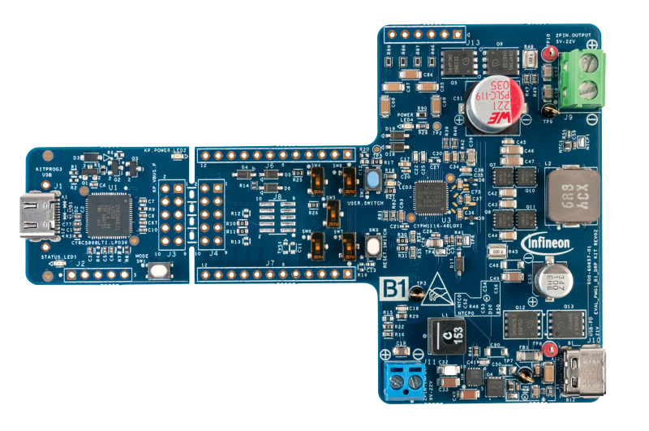

# EVAL_PMG1_B1_DRP BSP

## Overview

The EVAL_PMG1_B1_DRP Prototyping kit is a development platform to design products from the EZ-PD™ PMG1-B1  USB Power Delivery (PD) microcontroller (MCU) with an integrated buck-boost battery charger. EZ-PD™ PMG1-B1  is targeted for battery-powered applications that are powered by USB-C PD such as cordless power tool chargers,  wireless speakers, and portable electronics.

To use code from the BSP, simply include a reference to `cybsp.h`.

## Features

### Kit Features:

* Support for single Port USB PD 3.1 Source/ Sink Role (DRP).
* Support 100W sink operation and 27W source operation.
* Support USB bus/DC supply/battery powered operation.
* KitProg3 based programming and debug interface.
* Access to the pins of PMG1-B1 silicon (CYPM1116-48LQXI) in hardware and support for BSP, PDL and Middleware in ModusToolbox.
* The kit can provide a 5V/400mA supply to enable customers to power the peripherals/sensors if required. An on-board regulator from IFX can provide this power using the VBUS input. This is an optional requirement to be decided during the design phase.

### Kit Contents:

* EZ-PD CYPM116-48LQXI based board
* Quick Start Guide

## BSP Configuration

The BSP has a few hooks that allow its behavior to be configured. Some of these items are enabled by default while others must be explicitly enabled. Items enabled by default are specified in the EVAL_PMG1_B1_DRP.mk file. The items that are enabled can be changed by creating a custom BSP or by editing the application makefile.

Components:
* Device specific category reference (e.g.: CAT1) - This component, enabled by default, pulls in any device specific code for this board.

Defines:
* CYBSP_WIFI_CAPABLE - This define, disabled by default, causes the BSP to initialize the interface to an onboard wireless chip if it has one.
* CY_USING_HAL - This define, enabled by default, specifies that the HAL is intended to be used by the application. This will cause the BSP to include the applicable header file and to initialize the system level drivers.
* CYBSP_CUSTOM_SYSCLK_PM_CALLBACK - This define, disabled by default, causes the BSP to skip registering its default SysClk Power Management callback, if any, and instead to invoke the application-defined function `cybsp_register_custom_sysclk_pm_callback` to register an application-specific callback.

### Clock Configuration

| Clock    | Source    | Output Frequency |
|----------|-----------|------------------|
| CLK_HF   | CLK_IMO   | 48 MHz           |

See the [BSP Setttings][settings] for additional board specific configuration settings.

## API Reference Manual

The EVAL_PMG1_B1_DRP Board Support Package provides a set of APIs to configure, initialize and use the board resources.

See the [BSP API Reference Manual][api] for the complete list of the provided interfaces.

## More information
* [EVAL_PMG1_B1_DRP BSP API Reference Manual][api]
* [EVAL_PMG1_B1_DRP Documentation](https://www.infineon.com/EVAL_PMG1_B1_DRP)
* [Cypress Semiconductor, an Infineon Technologies Company](http://www.cypress.com)
* [Infineon GitHub](https://github.com/infineon)
* [ModusToolbox™](https://www.cypress.com/products/modustoolbox-software-environment)

[api]: https://infineon.github.io/TARGET_EVAL_PMG1_B1_DRP/html/modules.html
[settings]: https://infineon.github.io/TARGET_EVAL_PMG1_B1_DRP/html/md_bsp_settings.html

---
© Cypress Semiconductor Corporation (an Infineon company) or an affiliate of Cypress Semiconductor Corporation, 2019-2022.